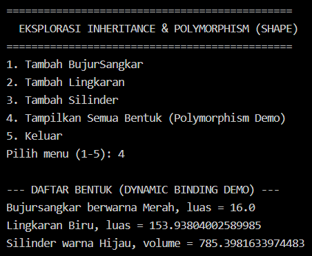
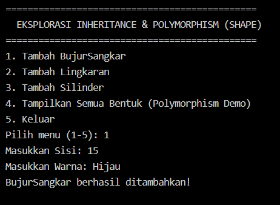
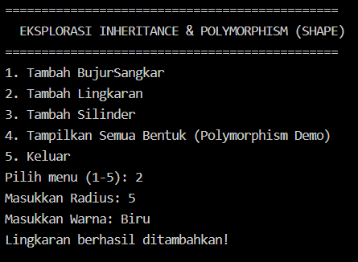
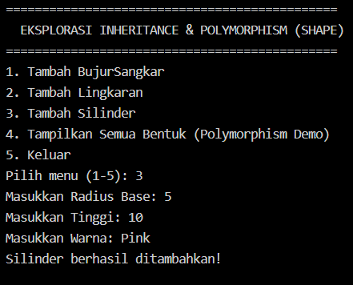
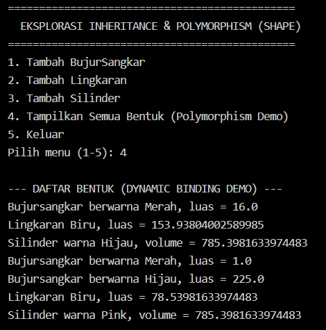

## Overview

This project is a Java-based console application designed to explore and demonstrate the fundamental concepts of Object-Oriented Programming (OOP)—specifically **Encapsulation**, **Inheritance**, and **Polymorphism**—based on pages 63–66 of the course materials.

The application models geometric 2D and 3D shapes using a structured class hierarchy (`Bentuk`, `BujurSangkar`, `Lingkaran`, and `Silinder`). It incorporates an interactive Command Line Interface (CLI) built with `java.util.Scanner` to enable dynamic creation, storage, and calculation of geometric properties.

---

## Class Hierarchy & Architecture

```
        +-------------------+
        |      Bentuk       |  (Base / Parent Class)
        +-------------------+
          /               \
         /                 \
+-----------------+   +-------------------+
|  BujurSangkar   |   |     Lingkaran     |  (Single Inheritance)
+-----------------+   +-------------------+
                                 |
                                 |
                      +-------------------+
                      |     Silinder      |  (Multilevel Inheritance)
                      +-------------------+

```

### Class Responsibilities

| Class | Type | Inherits From | Key Attributes | Key Methods |
| --- | --- | --- | --- | --- |
| `Bentuk` | Base Class | None | `warna` | `getWarna()`, `setWarna()`, `printInfo()` |
| `BujurSangkar` | Subclass | `Bentuk` | `sisi` | `hitungLuas()`, `printInfo()` |
| `Lingkaran` | Subclass | `Bentuk` | `radius`, `PHI` | `hitungLuas()`, `printInfo()` |
| `Silinder` | Subclass | `Lingkaran` | `tinggi` | `hitungVolume()`, `printInfo()` |

---

## OOP Pillars Demonstrated

### 1. Encapsulation

Data fields such as `sisi`, `radius`, and `tinggi` are protected from unauthorized direct access using `private` or `protected` access modifiers. State modifications and retrieval are handled strictly through explicit getter and setter methods.

### 2. Inheritance

* **Single Inheritance:** Both `BujurSangkar` and `Lingkaran` extend `Bentuk`, inheriting its core properties (`warna`) and behavior.
* **Multilevel Inheritance:** `Silinder` extends `Lingkaran`, reusing the `radius` field and `hitungLuas()` method while extending functionality to calculate 3D volume.
* **Constructor Chaining:** Subclass constructors invoke superclass constructors on their first line using the `super(...)` syntax.

### 3. Polymorphism

* **Method Overriding:** Each subclass redefines the `printInfo()` method inherited from `Bentuk` to print formatted calculation details specific to that shape.
* **Dynamic Method Dispatch:** In `Main.java`, objects are stored polymorphically inside an `ArrayList`. During runtime iteration, Java dynamically resolves and invokes the overridden `printInfo()` method corresponding to the actual object type.

---

## Application Screenshot




